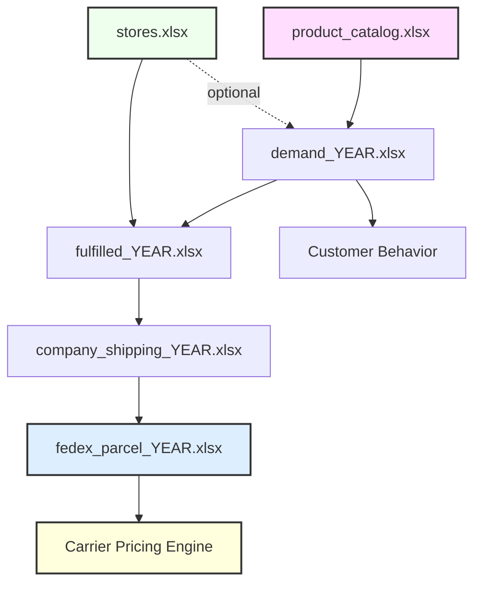

# Advanced Omni-Channel Retail & Parcel Simulation Engine

A high-fidelity synthetic data generator that simulates end-to-end retail operations — from customer demand to fulfillment, packaging, shipping, and carrier billing.

This version extends beyond basic order generation to model real-world logistics behavior, making it suitable for advanced analytics, supply chain modeling, and cost optimization.

---

## Project Purpose

This simulation engine generates realistic enterprise datasets that reflect:

- Customer purchasing behavior
- Omnichannel fulfillment decisions
- Store network constraints
- Package-level shipping behavior
- Carrier pricing mechanics
- Time-based operational events

**Designed for:**

- Supply chain analytics  
- Transportation & parcel modeling  
- Cost optimization studies  
- Data science & machine learning  
- Operations research  
- Advanced portfolio projects  

---

## Key Features

### Customer Simulation

- 100K+ synthetic customers
- Pareto-distributed order frequency (realistic repeat buyers)
- Customer-linked orders
- Synthetic email and identity fields

---

### Order & Fulfillment

- Two full years (2024 & 2025)
- Multi-line orders (1–7 items)
- BOPIS vs Ship-to-Home (STH)
- Curbside pickup flag
- Store-based fulfillment constraints:
  - Shipping-enabled stores
  - BOPIS-only stores
- Realistic tax calculations
- Timestamped order lifecycle (date + time)

---

### Store Network

- 25 stores across the U.S.
  - 10 shipping + BOPIS
  - 15 BOPIS-only
- City, state, ZIP, latitude, longitude
- Fulfillment logic tied to store capabilities

---

### Product Catalog

- 43,106 SKUs
- Long-tail demand distribution
- Price, weight, and dimensions
- 25 departments
- Persistent SKU usage across years

---

### Packaging & Shipment Simulation

- Multi-item orders packed into boxes
- 20 common box sizes
- Box-fitting (bin-packing style logic)
- Multi-package shipments per order
- Dimensional weight calculation
- Billable weight vs actual weight

---

### Geographic Modeling

- ZIP-based geographic consistency
- Lat/Lon generation tied to regions
- Haversine distance calculation
- Distance-based shipping zones (2–8)

---

### Carrier Pricing Engine

Simulates realistic carrier billing using structured rate cards:

- FedEx Home Delivery
- FedEx Ground
- FedEx Express Saver
- FedEx 2Day
- FedEx Standard Overnight

Includes:

- Zone-based pricing
- Weight brackets
- Fuel surcharge (12–22%)
- Large package handling fees
- DIM pricing logic

---

### Time-Based Simulation

- Order timestamps
- Ship timestamps
- Delivery timestamps
- Business-hour delivery windows (8 AM – 8 PM)
- Realistic delays and fulfillment timing

---

## Generated Output Files

### Product & Network

- **product_catalog.xlsx**
- **stores.xlsx**

---

### Order Data

For each year:

- **demand_YYYY.xlsx**
- **fulfilled_YYYY.xlsx**

Includes:

- Customer details
- Order timestamps
- Fulfillment method
- Destination geography
- Order totals (with and without tax)
- Shipment timing

---

### Shipping Data

For each year:

- **fedex_parcel_YYYY.xlsx**
- **company_shipping_YYYY.xlsx**

Includes:

- Multi-package shipments
- Tracking numbers
- Origin & destination coordinates
- Distance and pricing zone
- Service type
- Delivery timestamps
- Weight & dimensional data
- Final shipping charges

---

### Sample Files

- 5,000-row samples generated for each dataset
- Useful for quick analysis and demos

---

## Dataset Architecture & Relationships
    

    

## Configuration  
  
### Key parameters:

ORDERS_PER_YEAR = 250,500  
SHIPPED_PER_YEAR = 192,885  
START_ORDER_NUM = 2000000  

Adjustable for scale and performance.

## Requirements

Python 3.x with:

pandas
numpy

**Install:**  

pip install pandas numpy

**How to Run:**

python your_script_name.py

Outputs will be generated as Excel files in the working directory.

## Use Cases ##  

**This dataset enables advanced analytics such as:**  

Parcel cost optimization

Zone skipping analysis

Packaging efficiency modeling

Fulfillment strategy comparison

Customer demand analysis

Transportation network modeling

BI dashboards

Machine learning pipelines

## Data Privacy

All data is fully synthetic.

No real customer, company, or operational data is used.

## Why This Version Exists

**Real-world logistics systems involve complex interactions between:**  

Customers

Orders

Fulfillment nodes

Packaging decisions

Carrier pricing

**This simulation recreates those relationships to enable realistic analysis without proprietary data.**  

## License

Free for educational and portfolio use.
