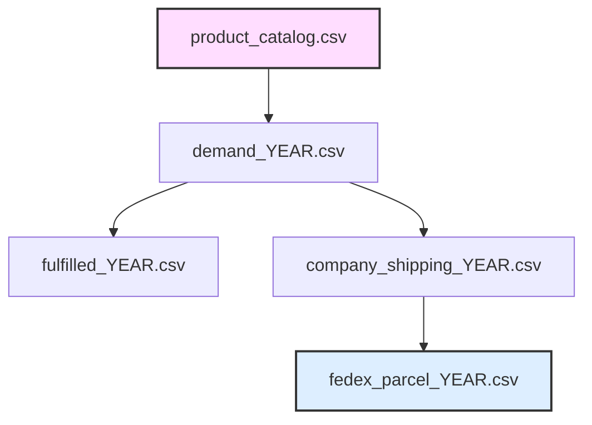

# Synthetic Omnichannel Retail Dataset Generator

A large-scale synthetic data generator that simulates enterprise eCommerce order demand, fulfillment operations, store networks, and parcel shipping activity across multiple years, replicating real-world omnichannel retail
operations, including multi-SKU orders, fulfillment modes (Buy online pick-up in store/Ship to home), cancellations, split shipments, dimensional pricing, and carrier billing.

This project creates interconnected datasets suitable for analytics, data engineering, operations research, forecasting, optimization, and portfolio demonstrations — without exposing proprietary business data.

---

## Project Purpose

This generator produces realistic omnichannel retail data that mirrors real-world complexity:

- High-volume order demand  
- Partial fulfillment and cancellations  
- Multi-SKU orders  
- BOPIS vs Ship-to-Home fulfillment  
- Store network geography  
- Parcel shipping activity  
- Product catalog with long-tail demand  
- Interconnected datasets across systems  

**Designed for:**

 Data analytics projects  
 Supply chain modeling  
 Logistics analysis  
 BI dashboards  
 SQL / Python practice  
 Portfolio demonstrations  
 Machine learning experiments  

---

## Key Features

### Orders & Fulfillment

- Two full years of demand (2024 & 2025)
- Configurable order volumes
- Shipped vs Cancelled orders
- Multi-line orders (1–7 SKUs per order)
- Realistic order totals based on price × quantity
- Consistent SKU usage across years with assortment changes
- BOPIS (Buy Online Pick Up In Store)
- STH (Ship To Home)

---

### Store Network

- 10 physical stores across the eastern U.S.
- Geographically dispersed (>180 miles apart)
- Store ZIP codes with latitude & longitude
- BOPIS orders ship to store locations

---

### Product Catalog

- 43,106 SKUs
- Long-tail demand distribution (Pareto-like)
- Item dimensions and weights
- Prices across a wide retail range
- 25 departments
- Realistic variability in product characteristics

---

### Parcel Shipping Simulation

Generated for Ship-to-Home orders only:

- Tracking numbers
- Carrier service types:
  - FedEx Home Delivery
  - FedEx Ground Economy
- Ship & delivery dates
- Rated vs actual weight
- Dimensional shipping logic
- DIM flags based on size and service rules
- Shipping charges
- Internal company shipping bridge file

---

## Generated Output Files

Running the script produces:

### Product & Network Data

- **product_catalog_1.csv** — Master SKU catalog  
- **stores_1.csv** — Store locations  

---

### Order Data

For each year (2024 & 2025):

- **demand_YYYY_1.csv** — All orders (shipped + cancelled)  
- **fulfilled_YYYY_1.csv** — Shipped orders only  

Each order line includes:

- Order Number  
- SKU & description  
- Quantity sold  
- Sales amount  
- Fulfillment method  
- Store node  
- Order date  
- Ship ZIP and coordinates  
- Line status  
- Ship date (if shipped)  

---

### Shipping Data

For each year:

- **fedex_parcel_YYYY_1.csv** — Simulated carrier billing file  
- **company_shipping_YYYY_1.csv** — Internal order → tracking bridge  

These files are relationally consistent with the order data.

---

## Dataset Architecture & Relationships

All keys align across datasets, enabling realistic joins and analysis.

---

## Configuration

Key parameters can be modified in the script:

ORDERS_PER_YEAR = 220_000  
SHIPPED_PER_YEAR = 170_000  
START_ORDER_NUM = 2000000  

These values were chosen to:

- Produce large, realistic datasets  
- Stay within Excel’s row limits  
- Maintain computational efficiency  

Random seeds ensure reproducibility.

---

## Dimensional Shipping Logic

DIM flags are triggered when shipments exceed thresholds such as:

- Large volume
- Long side length
- Service-specific weight limits
- Carrier service rules

This enables realistic shipping cost analysis.

---

## Requirements

Python 3.x with:  

pandas  
numpy  

Install if needed:  

pip install pandas numpy  

---

## How to Run

Execute the script:  

python your_script_name.py  

Output CSV files will be generated in the working directory.  

---

## Potential Use Cases

This dataset supports a wide range of projects:  

- Demand forecasting  
- Fulfillment optimization  
- Shipping cost analysis  
- Network planning  
- BI dashboards  
- SQL analytics  
- Data engineering pipelines  
- Machine learning models  
- Operational simulations  

---

## Data Privacy

All data is fully synthetic.

No real customer, company, or operational information is used or implied.

---

## Why This Project Exists

Enterprise-grade datasets are rarely public due to confidentiality.
This generator provides realistic data complexity for learning, experimentation, and demonstration without legal or ethical concerns.

---

## License

Free for educational and portfolio use.
